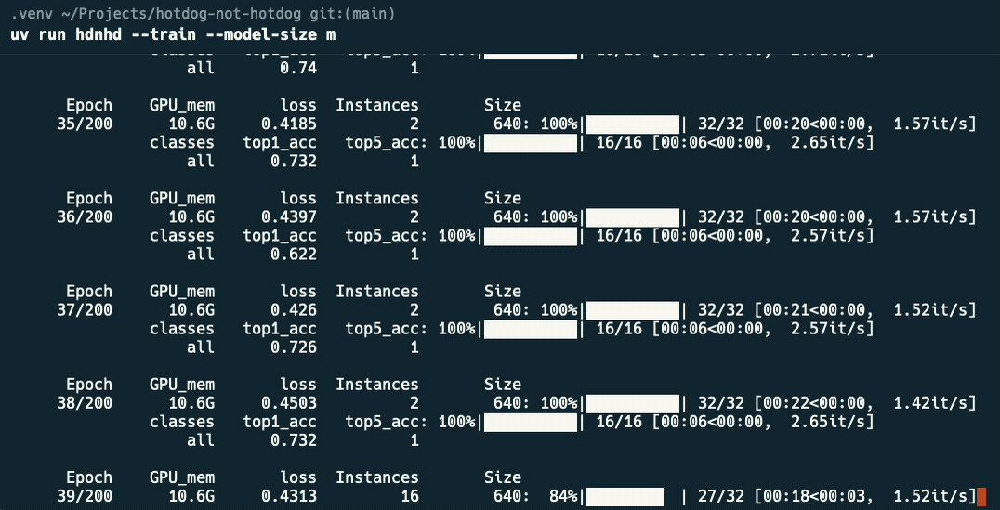

# Hot Dog, Not Hot Dog CLI

A project nobody asked for.

YOLO-based image classifier to detect whether an image contains a hotdog or not. Built with [Ultralytics](https://www.ultralytics.com/) [YOLO11](https://docs.ultralytics.com/models/yolo11/) and inspired by Silicon Valley's "See Food" app.

*Note: If you came here for a vibe coded project with API keys exposed, I'm happy to disappoint you, but let me know, I can point you in the direction of several - some of which are likely in production at med-large orgs!*

## Features

- **Train** custom hotdog classification models
- **Predict** on new images
- **Validate** model performance
- **Export** models in different formats (PyTorch, TorchScript)
- **CLI interface** for easy usage
- **Included dataset setup script** for training the model on a Kaggle dataset of sample images

## Setup

### Prerequisites

- Python 3.13+
- [uv](https://docs.astral.sh/uv/) package manager

### Installation

1. Clone the repository:
```bash
git clone <your-repo-url>
cd hotdog-not-hotdog
```

2. Install dependencies:
```bash
uv sync
```

#### Optional: Global Installation

For easier usage (and until we create a proper package distribution), you can install the package globally using uv tools:

```bash
uv tool install .
```

This allows you to run commands directly without `uv run`:
- `hdnhd --train` instead of `uv run hdnhd --train`
- `hdnhd-setup` instead of `uv run hdnhd-setup`

**Note**: The rest of this README assumes you're using `uv run` commands. If you've installed globally, simply remove the `uv run` prefix.

### Dataset Setup

#### Automatic Setup (Recommended)

The easiest way to set up the dataset is using our automated script:

```bash
# Install all dependencies (including Kaggle API)
uv sync

# Set up Kaggle API credentials (one-time setup)
# 1. Go to https://www.kaggle.com/account
# 2. Click "Create New API Token" to download kaggle.json
# 3. Place kaggle.json in ~/.kaggle/ directory
# 4. Set permissions: chmod 600 ~/.kaggle/kaggle.json

# Run the dataset setup script
uv run hdnhd-setup
```

The script will automatically:
- ✅ Download the dataset from Kaggle
- 📁 Create the proper directory structure
- 📋 Organize images into training and validation sets
- 🔍 Verify the dataset is ready for training

#### Manual Setup (Alternative)

If you prefer to set up the dataset manually:

1. Download the Hot Dog / Not Hot Dog dataset from Kaggle:
   - Visit: https://www.kaggle.com/datasets/dansbecker/hot-dog-not-hot-dog
   - Download the dataset (requires Kaggle account)
   - Extract the downloaded zip file

2. Organize the dataset in your project:

```bash
# Create the data directory structure
mkdir -p data/hotdog/{train,val}/{hot_dog,not_hot_dog}

# Copy images from the downloaded dataset
# Assuming you extracted to ~/Downloads/hot-dog-not-hot-dog/
cp ~/Downloads/hot-dog-not-hot-dog/train/hot_dog/* data/hotdog/train/hot_dog/
cp ~/Downloads/hot-dog-not-hot-dog/train/not_hot_dog/* data/hotdog/train/not_hot_dog/
cp ~/Downloads/hot-dog-not-hot-dog/test/hot_dog/* data/hotdog/val/hot_dog/
cp ~/Downloads/hot-dog-not-hot-dog/test/not_hot_dog/* data/hotdog/val/not_hot_dog/
```

#### Dataset Structure

Your final dataset should be organized as follows:

```
data/hotdog/
├── train/
│   ├── hot_dog/           # ~249 hotdog images
│   │   ├── image1.jpg
│   │   ├── image2.jpg
│   │   └── ...
│   └── not_hot_dog/       # ~249 not hotdog images
│       ├── image1.jpg
│       ├── image2.jpg
│       └── ...
└── val/
    ├── hot_dog/           # ~250 hotdog images
    │   └── ...
    └── not_hot_dog/       # ~250 not hotdog images
        └── ...
```

#### Verify Dataset

You can verify your dataset is properly set up:

```bash
# Count images in each directory
find data/hotdog/train/hot_dog -name "*.jpg" | wc -l
find data/hotdog/train/not_hot_dog -name "*.jpg" | wc -l
find data/hotdog/val/hot_dog -name "*.jpg" | wc -l
find data/hotdog/val/not_hot_dog -name "*.jpg" | wc -l
```

You should see approximately 249, 249, 250, and 250 images respectively.

**Note**: If you used the automatic setup script, verification is done automatically at the end of the process.

## Usage

The hotdog classifier provides a CLI interface with several commands:

### Training

Train a new model on your hotdog dataset:

```bash
# Basic training (exports as .pt format)
# 's' refers to model size and is the default
# however you can select from the following:
# n=YOLO11n, s=YOLO11s, m=YOLO11m, l=YOLO11l, x=YOLO11x
uv run hotdog-not-hotdog --train --model-size s

# Train and export as TorchScript if desired
# Otherwise it will default to .pt
uv run hotdog-not-hotdog --train --export-format torchscript
```



Training will:
- Use the dataset in `data/hotdog/`
- Train for 100 epochs
- Automatically validate the model
- Create and export to `models/` directory
- Create a `runs/` directory
- Download the `yolo11<size>-cls.pt` classifier model to the project root.

*Note*: You will see the model you are using (eg. `yolo11n-cls.pt`) installed in the root of the project directory.

### Prediction

Classify a single image (supports local files and web URLs):

```bash
# Local image file
uv run hotdog-not-hotdog --predict path/to/image.jpg --model models/hotdog_classifier.pt

# Web image URL
uv run hotdog-not-hotdog --predict https://example.com/hotdog.jpg --model models/hotdog_classifier.pt
```

### Validation

Validate an existing trained model:

```bash
uv run hotdog-not-hotdog --validate runs/classify/train/weights/best.pt
```

### Export

Export an existing trained model:

```bash
# Export as PyTorch (.pt) format
uv run hotdog-not-hotdog --export

# Export as TorchScript format
uv run hotdog-not-hotdog --export --export-format torchscript
```

## Model Performance

When I trained the model on the [kaggle hot_dog not_hot_dog dataset](https://www.kaggle.com/datasets/dansbecker/hot-dog-not-hot-dog) I achieved approximately **87.6% accuracy** on the validation set, with perfect top-5 accuracy for this binary classification task.

Having said that..... it sometimes thinks pizza is hot dog. My understanding is that pizza is not hot dog.

Expanding the training and validation samples and tweaking the hyperparmeters may produce a better model.

## Output Files

After training, you'll find:

- **Training artifacts**: `runs/classify/train/weights/`
  - `best.pt` - Best performing model
  - `last.pt` - Final epoch model
- **Exported models**: `models/`
  - `hotdog_classifier.pt` - PyTorch format
  - `hotdog_classifier.torchscript` - TorchScript format
- **Validation results**: `runs/classify/val*/`

## CLI Reference

```bash
uv run hotdog-not-hotdog --help
```

### Commands

All commands are mutually exclusive you can only run one at a time:

- `--train` - Train a new model on the dataset in `data/hotdog/`
- `--predict IMAGE_PATH --model MODEL_PATH` - Classify an image (local file or web URL)
- `--validate MODEL_PATH` - Validate a trained model against the validation dataset
- `--export` - Export the best trained model to the models directory

### Options

- `--model MODEL_PATH` - Path to model file (required for `--predict`, not used with other commands)
- `--export-format {pt,torchscript}` - Export format for trained models (default: pt)

### Examples

```bash
# Get help
uv run hotdog-not-hotdog --help

# Train a model
uv run hotdog-not-hotdog --train

# Predict on local image
uv run hotdog-not-hotdog --predict image.jpg --model models/hotdog_classifier.pt

# Predict on web image
uv run hotdog-not-hotdog --predict https://example.com/food.jpg --model models/hotdog_classifier.pt

# Validate a model
uv run hotdog-not-hotdog --validate runs/classify/train/weights/best.pt

# Export trained model as TorchScript
uv run hotdog-not-hotdog --export --export-format torchscript
```

### Local runs
When running (like I primarily do) on your local dev machine, you can pass the environment variable `DEV=True` to ensure environment variables (and any other environment specific behavior) are considered.

### Using with Ultralytics Hub

You can set the following variables in your `.env.local` file:

```
ULTRALYTICS_API_KEY=abcdefghijklmnopqrstuvwxyz1234567890
ULTRALYTICS_MODEL_URI="https://hub.ultralytics.com/models/<model-identifier>"
```

Doing so will allow you to train your model with the "bring your own agent" UI in [Ultralytics Hub](https://hub.ultralytics.com/models).

**Note**: Doing this will attempt to download the dataset stored in your Ultralytics Hub. I haven't spent the time (and likely won't) to determine how to bypass and use a local dataset instead.

## Development

### Project Structure

```
src/hotdog/
├── __init__.py
├── main.py      # CLI interface
├── train.py     # Training and validation logic
├── predict.py   # Prediction logic
└── utils.py     # Utility functions (device detection)
```

### Requirements

See `pyproject.toml` for full dependency list:
- ultralytics
- torch
- torchvision
- torchaudio

## License

See `LICENSE`